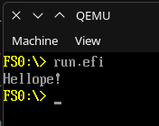

# Hand written EFI library for Odin
### ⚠️ Not finished! Some protocols are missing. Feel free to send a pull request if you get to it before I do.



## Quick start (🐧Linux)
Your main.odin file
```odin
package hellope

import "efi"

@(export) // This export is important! The library calls this when init is done.
efi_main :: proc() {
	efi.println("Hellope!")
}
```
And to build
```sh
odin build . \
	-default-to-panic-allocator \
	-no-thread-local \
	-no-crt \
	-build-mode:obj \
	-target:freestanding_amd64_win64

lld -flavor link \
	./*.obj \
	-subsystem:efi_application \
	-nodefaultlib \
	-dll \
	-out:hellope.efi
```
Then use something like [uefi-run](https://github.com/richard-w/uefi-run) to test it
```sh
uefi-run hellope.efi -b PATH_TO_OVMF.fd
```
